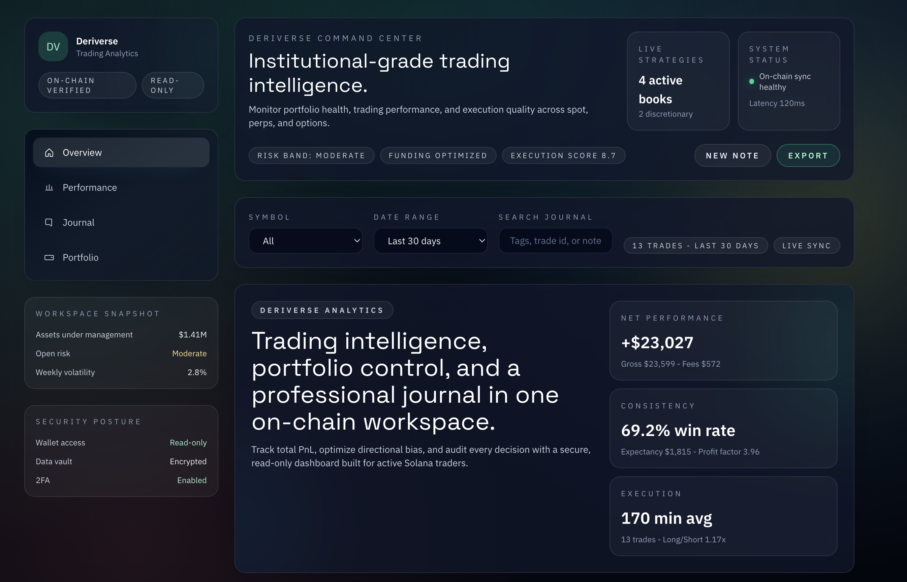

# Deriverse Trading Analytics Dashboard



Deriverse is a next-gen, fully on-chain, decentralized Solana trading ecosystem. This dashboard delivers a professional analytics suite with a trading journal, portfolio analysis, and performance intelligence for active traders.

## Highlights

- Institutional-grade dashboard layout with navigation, filters, and dedicated sections.
- High-signal metrics with visual performance indicators and drawdown tracking.
- Detailed trading journal with annotations and searchable entries.
- Portfolio allocation, exposure, and security posture insights.

## Feature Coverage

- Total PnL tracking with visual performance indicators
- Complete trading volume and fee analysis
- Win rate statistics and trade count metrics
- Average trade duration calculations
- Long/Short ratio analysis with directional bias tracking
- Largest gain/loss tracking for risk management
- Average win/loss amount analysis
- Symbol-specific filtering and date range selection
- Historical PnL charts with drawdown visualization
- Time-based performance metrics (daily, session-based, time-of-day)
- Detailed trade history table with annotation capabilities
- Fee composition breakdown and cumulative fee tracking
- Order type performance analysis

## Pages

- `Overview`: KPI tiles, PnL + drawdown, fees, and order-type performance.
- `Performance`: time-based analytics, session breakdowns, and directional bias.
- `Journal`: trade history table with tags and notes.
- `Portfolio`: allocation, exposure, and security posture.

## Tech Stack

- React Router
- TypeScript
- Tailwind CSS
- Vite

## Local Development

Install dependencies:

```bash
bun install
```

Run the dev server:

```bash
bun run dev
```

Open `http://localhost:5173`.

## Production Build

```bash
bun run build
```

## Notes on Security

- Designed for read-only access patterns.
- Assumes encrypted storage and scoped API permissions.
- UI highlights security posture and risk controls.
